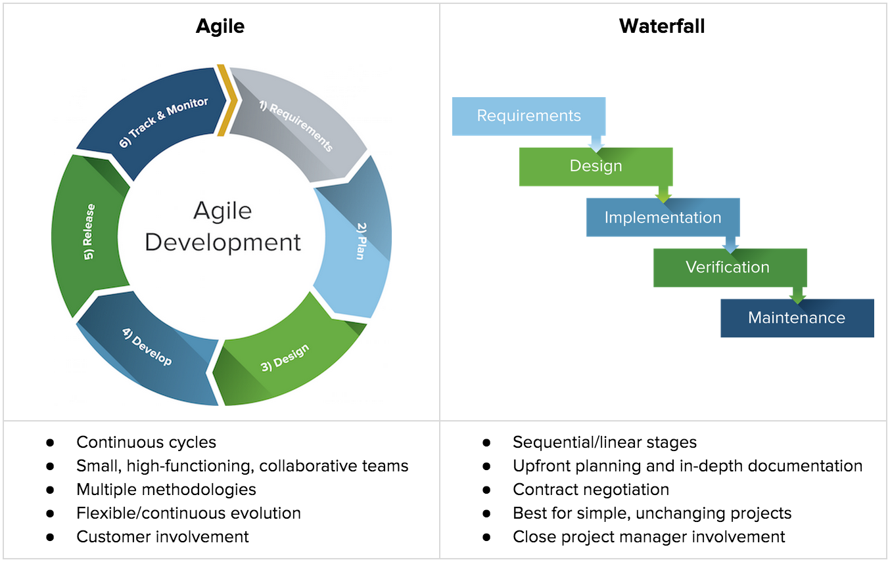
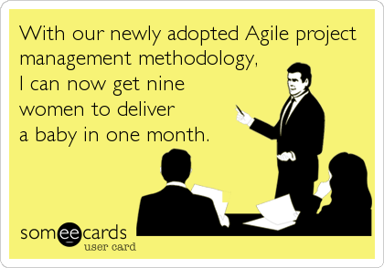

% Agile Project Management and Tools to Help
% Travis Hathaway
% December 30, 2019

# What we'll cover

- Agile project management

- Software to help you and your teams collaborate

# "Agile" management techniques... how do those work?

- Project management methodology originally from software engineering

- Relies on iterative approach to tackling problems

- Relies on cross-functional teams

- More flexible than the traditional "waterfall" approach to project management

# Agile vs. Waterfall

# Manifesto for Agile Software Development

- Customer satisfaction by early and **continuous delivery** of valuable software.

- Welcome changing requirements, even in late development.

- Regularly, the team reflects on how to become more effective, and adjusts accordingly

- Continuous attention to technical excellence and good design

- Close, daily cooperation between business people and developers

# Practical Applications

**Sprints** Short planning time frame last one to four weeks

**Epics** Projects that span multiple sprints

**Cross Functional Teams** Stand alone teams representing multiple disciplines

**Minimal Viable Product (MVP)** The smallest functional unit that can be delivered to customers

**Retrospective Meetings** Meetings performed at end of sprints to gauge performance and make suggestions for improvements

# Is the Agile approach right for you?

What does a "release" mean in the context of your project? 

Does your project rely on an iterative approach? (i.e. a series of milestones rather than one big release)

Can you identify "MVPs" within your project?

Can you identify how to tighten feedback loops between research subjects (i.e. customers) and researchers (i.e. developers)?

# Tools for Agile Project Management

# Not always appropriate

# Thank You!

For even more information on project management using agile techniques please don't hestitate to contact me:

travis.j.hathaway@gmail.com
